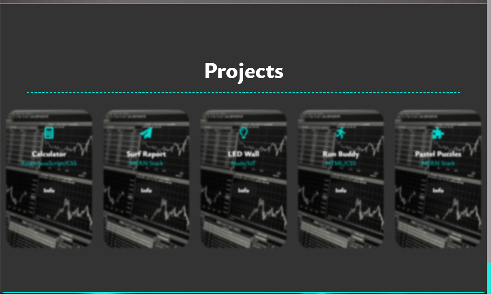

# Personal Portfolio (Challenge 2) 🧠

## Website Purpose:
    The purpose of the website is to create a portfolio where I can share my projects, social media, information about me and also ways to contact me (coming soon...) It is mostly for desktop use since I am still working on th emobile versin because its harder than th eoriginal one.

***
## Skills Used: 
I used many skills on this project to help me achieve the desired aesthetic and functionality. Here are the skills used:

**HTML:**
* Links.
* References.
* Lists.
* Nav Bars.
* Input types.
* Image insertions.

**CSS:**
* Pseudo elemets.
* Display methods.
* Media queries.
* Background Images.
* Cursor Style.

***
## Skills Learned:
    I learned a lot with this project because it taught me many things. One of this things is time management and its very important because on this kind of jobs time is limited and if I dont have that skill developed then everything is going to be extremely difficult. Another skill I developed during this time is the ability to research on the web for new concepts, methods and ideas for the implementation on the program/website. I also learned more a bout the pseudo elements and the best ways I could use it for in the future.

# Screen Shots:

***
# Link to my REPO:

GitHub Repository: [https://github.com/OkamiXX/02-Personal-Portfolio-CSS-HTML](https://github.com/OkamiXX/02-Personal-Portfolio-CSS-HTML)

Deployed Website:
